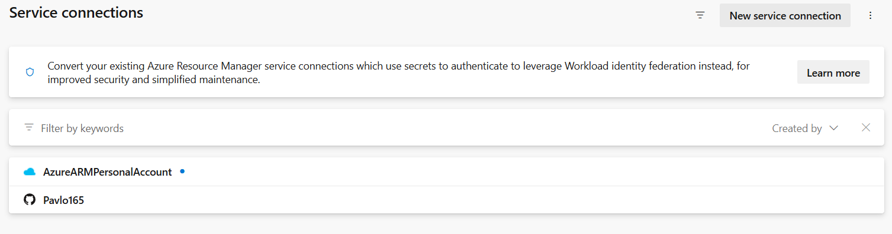
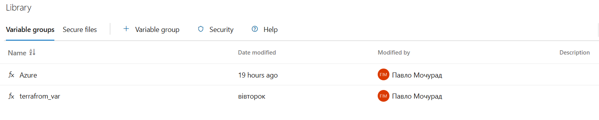
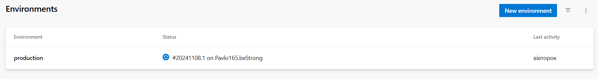
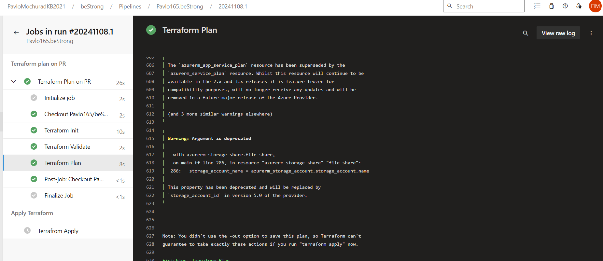
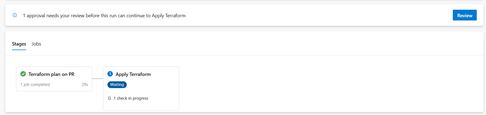
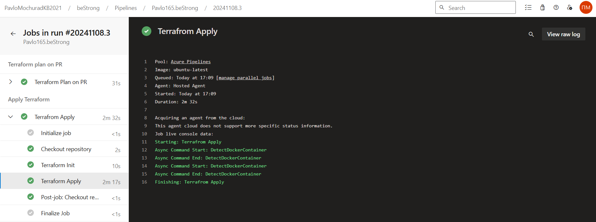
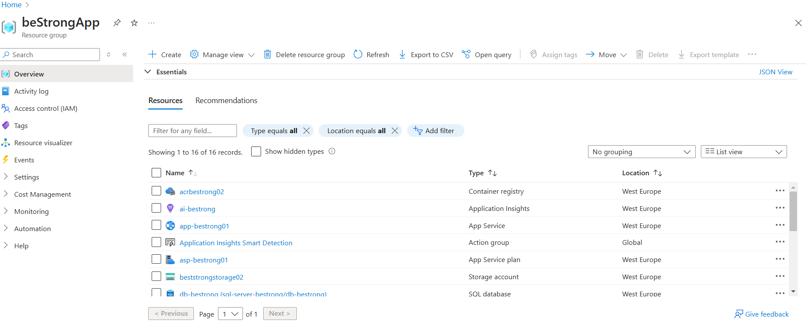

# Report on Task Completion

## Project Setup

Before starting to write the YAML file, I created a project called **bestrong**. The organization had already been set up for me.

Next, I created two service connections:
1. **GitHub** - to be used as the repository for the code.
2. **Azure ARM** - to serve as the provider.

## Pipeline Creation

Next, I moved on to creating a pipeline. The code is stored in the `.github/workflows/terraform.yml` folder. I imported this code from the repository into the **Azure DevOps Pipeline**.

## Variable Group

I stored the data for backend initialization and database credentials in a **variable group**. The `terraform` section contains the environment variables necessary to run Terraform (such as database credentials), and the `Azure` section holds the backend storage parameters.

## Pipeline Stages

The pipeline is divided into two stages: **plan** and **apply**.

- **Plan**: This stage automatically starts when a commit is made to the main branch.
- **Apply**: This stage will only start after the successful execution and manual confirmation of the first stage.

## Enviroment and manual approval

To enable the **apply** stage to run with manual confirmation, I created an environment called **production**, where I configured the manual approval process.

## Result of Work

- **Successful Execution of the Plan Stage**  
  The **plan** stage executed successfully.

  

- **Apply Stage Waiting for Manual Confirmation**  
  The **apply** stage is awaiting manual confirmation.

  

- **Execution of Apply Stage After Confirmation**  
  After manual confirmation, the **apply** stage is executed.

  

- **Deployed Resources in the Azure Portal**  
  The resources were successfully deployed and can be viewed in the Azure portal.

  
